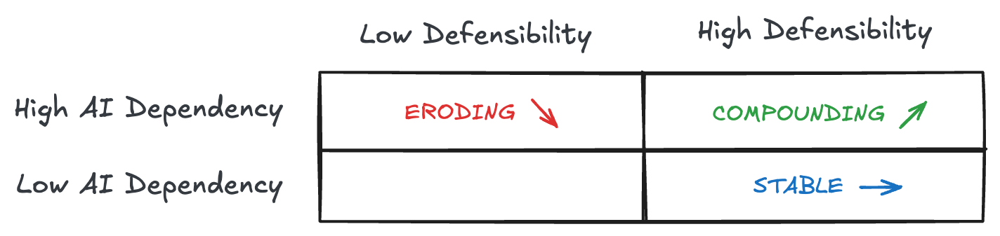

AI strategy isn't about how much AI you use. It's about whether AI progress erodes your value, leaves it unchanged, or compounds it.

---

## The Core Framework: Position × Trajectory

Two questions determine whether an AI product survives:

1. **Position:** How exposed are you to AI progress?
2. **Trajectory:** What happens to your value as models improve?

### The Position Matrix



The arrows show trajectory — what happens to your value as AI progresses. Position determines trajectory. Trajectory determines survivability.

**Key insight:** Model capability is not the x-axis of success. It's the x-axis of pressure. Products respond differently to that pressure.

**What "AI progress" means:** Two pressures, not one:

- **Better models (API):** The next frontier model ships, everyone gets access — including you
- **Better apps (ChatGPT, Claude):** The model providers ship better products that compete directly

Eroding products face both pressures. Compounding products benefit from the first and can withstand the second.

---

## Three Positions

### Eroding (High AI dependency, low defensibility)

AI is core to the product, but there's nothing protecting you. When models improve, your value decreases.

**The death zone.** You're competing on model access, which commoditizes. Every GPT upgrade makes "why not just use ChatGPT?" harder to answer.

**Jasper example:** "AI writing" isn't a job — it's a capability. When ChatGPT got better at writing, Jasper had nothing left. Revenue reportedly dropped from $120M to $55M. CEO replaced. Valuation cut.

### Compounding (High AI dependency, high defensibility)

AI is core, but value is defended by something that strengthens over time. When models improve, your product gets better.

**The goal.** You benefit from AI progress instead of being threatened by it. Not just "better model = better output" (everyone gets that) — your moat _amplifies_ the improvement. Better model × codebase context = disproportionately better. The moat is a multiplier, not a wrapper.

**Cursor example:** The job isn't "generate code" (ChatGPT does that). It's "help me code in this project." When the next model ships, Cursor gets better — because the value isn't the model, it's codebase indexing, multi-file edit UX, and a flywheel of hundreds of millions of daily interaction signals training their Tab model.

**Harvey example:** When ChatGPT gets better at legal, Harvey gets better too. They've embedded into firm workflows (SharePoint, Word), hired lawyers from Big Law (20% of staff), and built trust through compliance. The model is a component, not the product.

### Stable (Low AI dependency, high defensibility)

AI is additive, not core. When models improve, it doesn't really affect you.

**Safe harbor.** You were a good product before AI, and AI makes you incrementally better. Stable is not inferior — it's often the most defensible position for incumbents.

**Notion example:** Notion AI is a feature. Remove it, Notion still works.

---

## The Hard Test

> **If you remove the LLM and nothing structurally breaks, you're Stable.** **If a better model makes you irrelevant, you're Eroding.** **Compounding means both matter — AI is core AND you have a moat.**

The question that predicts survival: _"What happens to your product when the next frontier model ships?"_

---

## The Infrastructure Trap

The AI stack is the **cost of entry**, not the value.

Nadella's framing (YC AI Startup School, June 2025):

> "Is the model like SQL? Or is it the SaaS app itself?... if you sort of say model with some scaffolding and tool calling in some infinite loop is the product—that's where it gets a little confusing. But that's like saying a bunch of SQL business logic with SQL is what is an app."

**The model is SQL, not the app.** You still need to build a product on top.

```
What users expect as baseline (2025):
├── Remembers context      ─┐
├── Knows my data           │ Infrastructure
├── Can take actions        │ (the "SQL")
└── Doesn't hallucinate    ─┘

This is table stakes. This is not why they pay.
```

**The nuance:** Infrastructure becomes strategic when it serves a specific job. The distinction: are you building infrastructure for its own sake, or infrastructure that makes a specific job better?

---

## Sources of Defensibility

Four common mechanisms that create moats. These are **mechanisms, not a checklist** — you don't need all four, but you need at least one that actually holds.

They answer one question: **Why doesn't this collapse to ChatGPT + a better prompt?**

### 1. Job Ownership

You own a specific job end-to-end. Not "helps with coding" but "helps me code in this project, with my codebase context."

The job must be specific enough to build expertise around. "AI writing" (Jasper) isn't a job. "Contract review and due diligence" (Harvey) is.

### 2. Workflow Embedding

Where does the user interact with your AI?

- **Standalone:** User leaves work → opens ChatGPT → copies result → pastes back
- **Embedded:** AI is inside where they already work

Embedded creates switching costs. If you leave Cursor, you change how you work. If you leave ChatGPT, you bookmark a different site.

### 3. Data Flywheel

Usage → data → better product → more usage → more data.

**Cursor:** Captures developer behavior patterns — not just accept/reject, but how developers navigate codebases, what edits they make, what context they need. CEO Michael Truell: "The competitive dynamics of our market mirror search more than normal enterprise software markets." Usage drives data, data improves the product.

**Important:** Single-user personalization isn't a flywheel — it's lock-in. A flywheel means cross-user improvement. Flywheels are powerful but not mandatory — Harvey wins through expertise and trust instead.

### 4. Domain Expertise

Real knowledge about the problem space — not just "act as an expert" in a system prompt.

- **Domain knowledge:** What are the actual edge cases?
- **Domain patterns:** What shortcuts do experts use?
- **Domain workflows:** What's the end-to-end process?

You can't prompt your way to this. It comes from studying how people actually work.

---

## Summary

**Position × Trajectory**

| Position    | AI Dependency | Defensibility | Trajectory        |
| ----------- | ------------- | ------------- | ----------------- |
| Eroding     | High          | Low           | ↘ value decreases |
| Compounding | High          | High          | ↗ value increases |
| Stable      | Low           | High          | → value unchanged |

**AI progress = two pressures:** Better models (API) and better apps (ChatGPT, Claude). Eroding faces both. Compounding benefits from the first, withstands the second.

**Four mechanisms (not a checklist):** Job ownership, workflow embedding, data flywheel, domain expertise. You need at least one that actually holds.

**The test:** "What happens when the next model ships?" Eroding: "We're in trouble." Compounding: "We get better." Stable: "Doesn't really matter."

---

## References

**Core framing:**

- Nadella on "model is like SQL" — [YC AI Startup School (June 2025)](https://youtu.be/AUUZuzVHKdo)
- Clayton Christensen's Jobs-to-be-Done — [strategyn.com](https://strategyn.com/jobs-to-be-done)

**On defensibility:**

- "Wrapping My Head Around AI Wrappers" — [wreflection.com (Oct 2025)](https://www.wreflection.com/p/wrapping-my-head-around-ai-wrappers)

**Background reading:**

- [Sapphire Ventures "AI-Native Applications: A Framework" (Nov 2024)](https://sapphireventures.com/blog/ai-native-applications/)
- [BVP "Mastering Product-Market Fit for AI Founders" (Aug 2025)](https://www.bvp.com/atlas/mastering-product-market-fit-a-detailed-playbook-for-ai-founders)

---

_AI progress is pressure. Your position determines whether it erodes you, ignores you, or compounds you._
