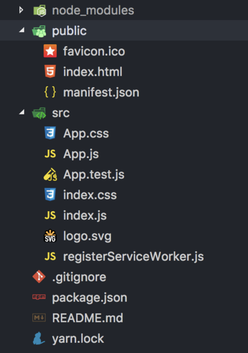
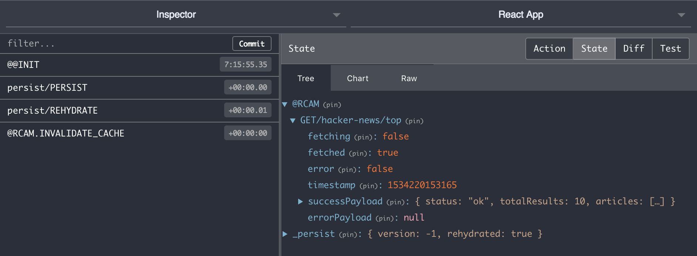

# How to Cache API Requests With Redux

> A tutorial on how to setup API requests caching in the Redux store.


After implementing API request caching a couple of times in recent years, I decided to give back to the open-source community. So I published a library called [`redux-cached-api-middleware`](https://www.npmjs.com/package/redux-cached-api-middleware) and thought I’d share my thoughts on why you’d want to cache API requests and how you can do it in your apps with fairly low effort.

## Why cache API requests

Well caching helps to re-load your apps faster and I believe we all hate those loading spinners 😡…
Faster re-load times lead to better UX, and higher conversion rates. So if you want higher revenue, you probably should consider this technique.
You probably already cache you web app’s static assets via caching headers, but you can go further than this and preserve the whole application state. That’s where [`redux-cached-api-middleware`](https://www.npmjs.com/package/redux-cached-api-middleware) in combination with other well know libraries can fast track your project 🏎!

## How to start caching

For learning purposes let’s build a minimalistic Hacker News app that displays top articles. The example will be a React app, but core ideology applies to any Redux project.

The [`create-react-app`](https://github.com/facebook/create-react-app) is an easy way to start:

```bash
yarn create react-app hn-lite && cd hn-lite
```

Which should create a project with a structure, similar to this:



### The setup

Install some core dependencies:

```bash
yarn add babel-polyfill \
  whatwg-fetch \
  redux \
  react-redux \
  redux-thunk \
  redux-api-middleware \
  redux-cached-api-middleware \
  redux-devtools-extension \
  babel-polyfill
```

We added some polyfills and some Redux related dependencies, let’s identify what are they used for:

- [`redux-thunk`](https://www.npmjs.com/package/redux-thunk) — async actions in redux
- [`redux-api-middleware`](https://www.npmjs.com/package/redux-api-middleware) — middleware for calling APIs
- [`redux-cached-api-middleware`](https://www.npmjs.com/package/redux-cached-api-middleware) — a light-weight library (uses above libs as [peer dependencies](https://nodejs.org/en/blog/npm/peer-dependencies/)) that adds caching capabilities
- [`redux-devtools-extension`](https://www.npmjs.com/package/redux-devtools-extension) — hook your redux state with browser dev tools

Setup the Redux store instance in state.js file:

```jsx
import { createStore, combineReducers, applyMiddleware } from 'redux';
import thunk from 'redux-thunk';
import { apiMiddleware } from 'redux-api-middleware';
import api from 'redux-cached-api-middleware';
import { composeWithDevTools } from 'redux-devtools-extension';

export const store = createStore(
  combineReducers({
    [api.constants.NAME]: api.reducer,
  }),
  composeWithDevTools(applyMiddleware(thunk, apiMiddleware)),
);
```

And wrap our App component with Redux Provider:

```jsx
import React from 'react';
import ReactDOM from 'react-dom';
import { Provider } from 'react-redux';
import 'babel-polyfill';
import 'whatwg-fetch';

import App from './App';
import { store } from './state';
import './index.css';

ReactDOM.render(
  <Provider store={store}>
    <App />
  </Provider>,
  document.getElementById('root'),
);
```

That’s it, we’re ready to start caching 🚀

### Let’s call an API

We’ll be using [News API](https://newsapi.org/docs) to fetch top headlines from Hacker News. 10 minutes is probably a reasonable cache time, so we will use a [caching strategy](https://github.com/karolis-sh/redux-cached-api-middleware#caching-strategies) to define the logic in the `App.js` file.

```jsx
import React from 'react';
import PropTypes from 'prop-types';
import { connect } from 'react-redux';
import api from 'redux-cached-api-middleware';

import Spinner from './Spinner';
import Articles from './Articles';

const CACHE_KEY = 'GET/hacker-news/top';

class App extends React.Component {
  componentDidMount() {
    const { requestData } = this.props;
    requestData();
  }

  render() {
    const { result } = this.props;
    if (result && result.fetched) {
      const { fetching, error, successPayload } = result;
      return (
        <div className="content">
          {fetching && <Spinner small />}
          {!fetching && error && <div className="error">An error occurred</div>}
          {successPayload && <Articles items={successPayload.articles} />}
        </div>
      );
    }
    return <Spinner />;
  }
}

const enhance = connect(
  (state) => ({
    result: api.selectors.getResult(state, CACHE_KEY),
  }),
  (dispatch) => ({
    requestData() {
      return dispatch(
        api.actions.invoke({
          method: 'GET',
          headers: {
            Accept: 'application/json; charset=utf-8',
            'x-api-Key': process.env.REACT_APP_API_KEY,
          },
          endpoint: 'https://newsapi.org/v2/top-headlines?sources=hacker-news',
          cache: {
            key: CACHE_KEY,
            strategy: api.cache
              .get(api.constants.CACHE_TYPES.TTL_SUCCESS)
              .buildStrategy({ ttl: 600000 }), // 10 minutes
          },
        }),
      );
    },
  }),
);

App.propTypes = {
  result: PropTypes.shape({
    fetching: PropTypes.bool.isRequired,
    fetched: PropTypes.bool.isRequired,
    error: PropTypes.bool.isRequired,
    timestamp: PropTypes.number,
    successPayload: PropTypes.any,
    errorPayload: PropTypes.any,
  }),
  requestData: PropTypes.func.isRequired,
};

export default enhance(App);
```

This way if the `App` component would be re-mounted in the 10-minute interval, the API response would be returned from the cache and not requested again.

This may not look that useful for one component, but when you have multiple components that need the data from the same endpoint — it can get really handy. For example at my workplace we have a `WithUserInfo` component that fetches some basic user data and passes to another component (see [render prop](https://reactjs.org/docs/render-props.html)). We have multiple `WithUserInfo` elements in the React tree, but the API still gets called only once (even when the cache gets outdated).

```jsx
function Header() {
  return (
    <WithUserInfo
      render={({ username }) => <header>Hello, {username}!</header>}
    />
  );
}
```

```jsx
function CTAButton() {
  return (
    <WithUserInfo
      render={({ type }) => {
        switch (type) {
          case 'FREE':
            return <Button primary>Check out premium features</Button>;
          case 'STANDART':
            return <Button secondary>Feedback</Button>;
          default:
            return <Button primary>Try the product for free</Button>;
        }
      }}
    />
  );
}
```

I really like this approach, because then you don’t have to load all the data in some `AppWrapper` component . Every component not only encapsulates the representation part but also the API data source logic. This way you can achieve a progressive loading effect — data is requested only when a component that needs it is added to the React tree.

### Recovering after page refresh

Another cool trick you can do with caching is persist your redux state to offline storage (for e.g. `localStorage`) via [`redux-persist`](https://www.npmjs.com/package/redux-persist).

Let’s update our setup, so that even when user re-opens the tab the previous state will be in place:

```jsx
import { createStore, applyMiddleware } from 'redux';
import thunk from 'redux-thunk';
import { apiMiddleware } from 'redux-api-middleware';
import api from 'redux-cached-api-middleware';
import { composeWithDevTools } from 'redux-devtools-extension';
import { persistStore, persistCombineReducers } from 'redux-persist';
import storage from 'redux-persist/lib/storage';

const persistConfig = {
  key: 'hn-lite-1',
  storage,
};

const apiNormalizer = (store) => (next) => (action) => {
  const result = next(action);
  if (action.type === 'persist/REHYDRATE') {
    store.dispatch(api.actions.invalidateCache());
  }
  return result;
};

export const store = createStore(
  persistCombineReducers(persistConfig, {
    [api.constants.NAME]: api.reducer,
  }),
  composeWithDevTools(applyMiddleware(thunk, apiMiddleware, apiNormalizer)),
);

export const persistor = persistStore(store);
```

Notice the `apiNormalizer` middleware — it is used to recover from a broken state (when the user closes the tab, but the request was in progress).

And wrap our `App` with `PersistGate` component:

```jsx
import React from 'react';
import ReactDOM from 'react-dom';
import { Provider } from 'react-redux';
import { PersistGate } from 'redux-persist/integration/react';
import 'babel-polyfill';
import 'whatwg-fetch';

import App from './App';
import { store, persistor } from './state';
import './index.css';

ReactDOM.render(
  <Provider store={store}>
    <PersistGate persistor={persistor}>
      <App />
    </PersistGate>
  </Provider>,
  document.getElementById('root'),
);
```

Refresh the page and notice the state getting restored:



Check the full [source code](https://github.com/karolis-sh/rcam-demos/tree/master/demos/hn-lite).

## Conclusion

Caching is great UX overall and progressive loading perceives that the application is loading faster. Everyone uses APIs differently, so the API wrappers have to be flexible:

- [`redux-api-middleware`](https://github.com/agraboso/redux-api-middleware) let’s you pass your own fetch implementation
- with [`redux-cached-api-middleware`](https://www.npmjs.com/package/redux-cached-api-middleware) you can either pass a predefined caching strategy or define you own `shouldFetch` resolver

Happy caching!
